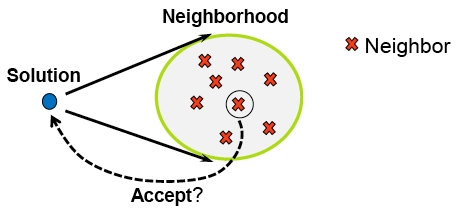

# How to implement your first hill-climber algorithm?
This lesson will let you
* Run your first simple Hill-Climber within MO library
* Learn the main principles of MO
* Browse through the code of these algorithm
* Run other kind of Hill-Climbers: first-improvment, random best, neutral hill-climbers.
* Design your own evaluation functions
* Add your own stopping criteria

## 1. I want to run my first hill-climber!
If you followed the the Install instructions, all examples would be compiled. If it is not the case, refer to the above instructions.

You can run your hill-climber. From the "build/mo/tutorial/Lesson1" directory, type:
```shell
./lesson1_simpleHC -V=20
```
Great! A very simple hill-climber had solved the oneMax problem (which maximizes the number of ones in the bit string) for the bit strings of size 20. On your output screen, you can see on the first line the random initial solution, and the second line, the final solution which is (I hope) the bit string of size 20 with all ones. For example:
```text
initial: 6 20 00010000011000100101
final: 20 20 11111111111111111111
```
The first number is the fitness of the solution, the second the size of the bit string and following all the bits of the solution.

## 2. The main principles of MO
In MO a local search is defined by this schema:



At each iteration, from the current solution:
* Generate neighbors from the neighborhood and evaluate them
* Select a neighbor
* Decide to replace solution by the selected neighbor

Like in paradisEO-eo, MO separates the representation-dependent part (represention of solution, neighbor, evaluation) from the generic part (the order of neighbors generation, selection, replacement, etc.).

So, to define a local search, it is necessary to define:
* the solution representation,
* the neighbor representation,
* the evaluation function of a solution,
* the evaluation function of a neighbor,
* the neighborhood (generation of the neighbors)

If you can define the representation-dependent part of your problem, you can use all local search algorithms from MO (Hill-climbing, simulated annealing, tabu search, iterated local search, variable neighborhood search, and more) and even combined them with evolutionary algorithms !

Of course a lot of classical representations, neighborhoods and problems are already defined in MO. They will be explained all along this tutorial.
Let's first have a look on the oneMax problem solved by a simple Hill-Climber algorithm defined as follows:
```text
Choose randomly initial solution x
Do
  best <- first neighbor of x
  For all y in the neighborhood of x
     If (f(y) > f(best))
        best <- y
     endif
  endfor
  If (f(x) < f(best))
     x <- best
     continue <- true
  else
     continue <- false
  endif
  While continue == true 
```

The simple HC stops on local optima when no improvement can not be made.

## 3. Browsing the code

Now let's have a look on the code. All the elements of the simple HC are already defined in the MO framework, and the code only puts all this bricks together. The code following the previous general principles. It defines the solution and neighbor representation, the solution and neighbor evaluation, the neighborhood, and the local search used.
Please, open the file "mo/tutorial/Lesson1/lesson1_simpleHC.cpp", and follow me in the code:

### 1. The includes part:

The general includes for the c++ stdlib streams:
```c++
#include <stdexcept>  
#include <iostream>   
#include <sstream>    
#include <fstream>
#include <string.h>
```

This includes for eo which contains all include files of EO:
```c++
#include <eo>
```

The first line to include the bit string representation defined in eo, and the second one to include the bit string neighbor representation. All classical problem-dependent part of MO are defined in the sub-directory "problems". How to define your representation is explained in EO tutorial, and how to design your neighbor will be explain in the next lesson 2. Here just use it.
```c++
#include <ga/eoBit.h>                         
#include <problems/bitString/moBitNeighbor.h>
```

This includes the evaluation function of a solution (full evaluation), the incremental evaluation of a neighbor for the oneMax problem, and a possible evaluation of neighbor using the full evaluation. You will learn at the end how to define your evaluations.
```c++
#include <problems/eval/oneMaxFullEval.h>
#include <problems/eval/moOneMaxIncrEval.h>
#include <eval/moFullEvalByModif.h>
```

This neighborhood visits all bit string at Hamming distance 1 in increasing order of bit index from bit 0 to bit vecSize-1. All the neighborhoods are included in the "neighborhood" directory.
```c++
#include <neighborhood/moOrderNeighborhood.h>
```

Now we can include the simple hill-climbing local search. All local search algorithms are included in the "algo" directory.
```c++
#include <algo/moSimpleHC.h>
```

### 2. The typedef part:

EO can apply an evolutionary algorithm on any type of solution. So, all EO classes are parametrized by the type of solutions, and it is useful to use a synonym (with a typedef) of the solution's type.
MO can apply an local search algorithm on any type of solution and neighbor. So, for the same reason, all classes of MO are parametrized by the neighbor's type. In the neighbor class, the solution's type is defined. More precision on the neighbor design will be given in the lesson 2.
Here the solution representation is a bit string and the neighbor representation is related to a bit string solution and Hamming distance 1 (only 1 bit can be flipped), both using an "unsigned int" fitness value.
```c++
typedef eoBit<unsigned int> Indi;
typedef moBitNeighbor<unsigned int> Neighbor;
```

### 3. Object definition part:

Follows the main function "main_function" where all useful objects are defined.\\
First, a code to parse the command line and a file. It gives the value of the random seed and the size of bit string. The lesson 3 of EO tutorial gives more precision on this code. Here we have only to understand that the variables "seed" and "vecSize" are initialized.
```c++
eoParser parser(argc, argv);

eoValueParam<uint32_t> seedParam(time(0), "seed", "Random number seed", 'S');
parser.processParam( seedParam );
unsigned seed = seedParam.value();

// length of the bit string
eoValueParam<unsigned int> vecSizeParam(8, "vecSize", "Genotype size", 'V');
parser.processParam( vecSizeParam, "Representation" );
unsigned vecSize = vecSizeParam.value();
(...)
```

To seed the random seed (see lesson 1 of EO tutorial for more precision):
```c++
rng.reseed(seed);
```

The definition the initialization of solutions is not defined is MO but in EO. The "eoInitFixedLength" is a class that makes a random intialization of bit string of a given length. Each bit is true with 1/2 rate. You can see the lesson 1 of EO tutorial lesson 1 for more precision.
```c++
eoUniformGenerator<bool> uGen;
eoInitFixedLength<Indi> random(vecSize, uGen);
```

The fitness function of the oneMax problem is the number of 1 in the bit string. It is already defined in MO:
```c++
oneMaxFullEval<Indi> fullEval;
```

A neighbor is not necessary a modified copy of the solution. But often a neighbor defines how to move, i.e. how to modify a solution to compute the neighbor. For example, for the bit string, a neighbor indicates which bit is flipped.
In the same way, it is often possible to define the incremental evaluation of a neighbor knowing the modification (the move).
The incremental evaluation for the oneMax problem is already defined and adds +1 or -1 at the fitness value according to the flipped bit.
```c++
moOneMaxIncrEval<Neighbor> neighborEval;
```

When the incremental evaluation can not be defined. The neighbor can be evaluated with the full evaluation. First the solution is modified on the neighbor, than the full evaluation is computed on it and then the solution is move back. This is done by the class "moFullEvalByModif". If you want you to test it comment the line with moOneMaxIncrEval and uncomment the line with moFullEvalByCopy:
```c++
// moFullEvalByModif<Neighbor> neighborEval(fullEval);
```

For the simple hill-climbing, all the neighbors are explored in increasing order of their bit flip. So, you can use the class "moOrderNeighborhood" where the size of the neighborhood has to be precise in the constructor:
```c++
moOrderNeighborhood<Neighbor> neighborhood(vecSize);
```

All representation-dependent part is now defined, so the simple Hill-Climbing can be defined. The constructor needs the neighborhood, the solution and neighbor evaluations. The solution and neighbor representation are defined by the template of the class:
```c++
moSimpleHC<Neighbor> hc(neighborhood, fullEval, neighborEval);

```

### 4. The execution of hill-climbing part:

Always in the "main_function" function, it is the execution part.
In MO, the local search algorithm never initializes the solution. It must be made outside the local search algorithm. This allows to combine local search algorithms with evolutionary algorithms or with others local search algorithms.
Now apply your local search on the solution as follows:
```c++
// The current solution
Indi solution;

// random initialization
random(solution);

// Evaluation of the intial solution:
// can be evaluated here, or else it will be done at the beginning of the local search
fullEval(solution);

// output: the initial solution
std::cout << "initial: " << solution << std::endl ;

// apply the local search on the solution !
hc(solution);

// output: the final solution
std::cout << "final:   " << solution << std::endl ;
```

The main line is "hc(solution)" which apply the local search on the solution.
Easy, isn't it?

## 4. Others hill-climbing algorithms

You may think that the simple hill-climbing is not the hill-climbing you need because you don't want to explore all the neighborhood or because there is several solutions with the same fitness value.

You may want to implement the first improvement hill-climbing defined as follows:
```text
Choose randomly initial solution x
Do
  y <- not visited random neighbor of x
  If (f(x) < f(y))
     x <- y
  else
     y.visited <- true
  endif
  While number of non visited neighbor of x > 0
```

In the first improvement HC, if the fitness of a random neighbor is higher than the current fitness, the neighbor is selected. And this hill-climber stops on local optima when no more fitness improvement can be made in the neighborhood.

To implement the first improvement HC, you have to change only 2 lines in the previous code.
The one to change the neighborhood generation:
```c++
moRndWithoutReplNeighborhood<Neighbor> neighborhood(vecSize);
```
In this neighborhood, the neighbors are generated in an randomly order (not from 0 to vecSize-1) without replacement which means that the neighbors are generated only once.

And of course, the other one to change the local search algorithm:
```c++
moFirstImprHC<Neighbor> hc(neighborhood, fullEval, neighborEval);
```

The corresponding include files have to be changed too. See and run the code "mo/tutorial/Lesson1/lesson1_firstImprHC.cpp".

For a hill-climbing which takes care on the solutions with equal fitness value such as this one:
```text
Choose randomly initial solution x
Do
  bestVect <- [ first neighbor of x ]
  For all y in the neighborhood of x
     If (f(y) > f(bestVect.first))
        bestVect <- [ y ]
     else if (f(y) == f(bestVect.first) and y != bestVect.first)
        bestVect.push_back(y)
     endif
  endfor
  If (f(x) < f(bestVect.first))
     x <- choose randomly a solution from bestVect
     continue <- true
  else
     continue <- false
  endif
  While continue == true 
```

You only have to change the local search algorithm by (see the code in mo/tutorial/Lesson1/lesson1_randomBestHC.cpp) :
```c++
moRandomBestHC<Neighbor> hc(neighborhood, fullEval, neighborEval);
```

Easy, isn't it?

And if you don't want that your hill-climber stops if there is some solution with the same fitness in the neighborhood like this:
```text
nbStep <- 0
Choose randomly initial solution x
Do
  bestVect <- [ first neighbor of x ]
  For all y in the neighborhood of x
     If (f(y) > f(bestVect.first))
        bestVect <- [ y ]
     else if (f(y) == f(bestVect.first))
        bestVect.push_back(y)
     endif
  endfor
  If (f(x) <= f(bestVect.first))
     x <- choose randomly a solution from bestVect
     continue <- true
  else
     continue <- false
  endif
  nbStep <- nbStep + 1 
  While continue == true and nbStep > nbStepMax 
```
 
This hill-climber stops on strict local optima, but not plateau which are local optima. So, another parameter is need to stop the algorithm (nbStepMax). Then you only have to change the local search algorithm by (see the code in Lesson1/lesson1_neutralHC.cpp) :
```c++
moNeutralHC<Neighbor> hc(neighborhood, fullEval, neighborEval, nbStepMax);
```

Easy, isn't it?

## 5. Define your evaluation

### 1. Evaluation of solutions:
You can learn to define your fitness function in the EO tutorial lesson 1. But let's me shortly explain how to do.
You have to define a class inherited from the "eoEvalFunc<EOT>". For example, the oneMaxFullEval is defined as follows:
```c++
#include <eoEvalFunc.h>
template< class EOT >
class oneMaxFullEval : public eoEvalFunc<EOT>
{
public:

	/**
	 * Count the number of 1 in a bitString
	 * @param _sol the solution to evaluate
	 */
    void operator() (EOT& _solution) {
        unsigned int sum = 0;
        for (unsigned int i = 0; i < _solution.size(); i++)
            sum += _solution[i];
        _solution.fitness(sum);
    }
};
```

The file "eoEvalFunc.h" must be included at the begining. The class "oneMaxFullEval" inherits from the "eoEvalFunc" class. Like all class in EO, the classes are templatized by the solution type "EOT".
EO uses a functor style: the fitness function is computed in the method "operator()(EOT& _sol)". Do what you want to compute the fitness value in this method, and puts the fitness value in the solution at the end by using its method "fitness":
```c++
_solution.fitness( fitnessValue );
```

The "eoBit" class is vector of boolean. The size of the vector is obtained by the method "size()":
```c++
_solution.size()
```
and the value of the ith bit is given by the classical method "operator[]":
```c++
_solution[i]
```
The fitness value of a solution can be obtained with the method "fitness()":
```c++
_solution.fitness()
```

### 2. Evaluation of neighbors:
MO uses the same idea to evaluate a neighbor. You have to define a class which inherits from "moEval" class. For example, the oneMaxIncrEval is defined as follows:
```c++
#include <eval/moEval.h>
template< class Neighbor >
class moOneMaxIncrEval : public moEval<Neighbor>
{
public:

    typedef typename Neighbor::EOT EOT;

    /*
    * incremental evaluation of the neighbor for the oneMax problem
    * @param _solution the solution to move (bit string)
    * @param _neighbor the neighbor to consider (of type moBitNeigbor)
    */
    virtual void operator()(EOT & _solution, Neighbor & _neighbor) {
	if (_solution[_neighbor.index()] == 0)
	    _neighbor.fitness(_solution.fitness() + 1);
	else 
	    _neighbor.fitness(_solution.fitness() - 1);
    }
};

```

The file "moEval.h" must be included at the begining. All class to define evalutation function are in the "eval" directory of MO. The class "oneMaxIncrEval" inherits from the "moEval" class. Like all class in MO, the classes are templatized by the neighbor's type "Neighbor".
A typedef is defined to easily have access to the solution type "EOT". The solution type is the type "EOT" in the class of Neighbor:
```c++
typedef typename Neighbor::EOT EOT;
```

MO also uses a functor style: the evaluation function is computed in the method "operator()(EOT& _solution, Neighbor & _neighbor)" which depends on the current solution and its neighbor to consider. Do what you want to compute the fitness value of the neighbor in this method, and puts the fitness value in the neighbor by using its method "fitness":
```c++
_neighbor.fitness( fitnessValue );
```

The "moBitNeighbor" has a method "index()" which gives the number of flipped bit. When the flipped bit of the solution is set to "0" the number of 1 in the neighbor is increased by one, and decreased by one otherwise.
When it is possible the incremental evaluation of neighbor gives a better complexity. For example the full evaluation needs vecSize comparisons, and the incremental evaluation only one comparison.
This prototypical example helps you to define your own solution and neighbor evaluations !

### 6. Use your stopping criteria

All local search algorithms have their own stopping criteria, but it is possible to add other stopping criteria. The predefined stopping criteria you can add are:
* stop on the number of iterations
* stop on the number of full evaluation
* stop on the number of neighbor evaluation
* stop on the fitness value reached
* stop on a time limit

All criteria inherit from the class "moContinuator" in the directory "continuator". To use one of them, you have to include the correct file, to define your object from the class and add the continuator to the local search constructor.
For example, to add a maximum number of iteration to your simple hill-climber. First include the correct file:
```c++
#include <continuator/moIterContinuator.h>
```

Define an object from the class:
```c++
moIterContinuator<Neighbor> continuator(iterMax);
```

And add the continuator in the constructor of the HC:
```c++
moSimpleHC<Neighbor> hc(neighborhood, fullEval, neighborEval, continuator);
```

Examples on all continuators are given in the source codes "lesson1_iterContinuator.cpp", "lesson1_fitContinuator.cpp", "lesson1_fullevalContinuator.cpp", "lesson1_evalContinuator.cpp".

It is also possible to combine several continuators with the class "moCombinedContinuator.h" as follows:
```c++
moIterContinuator<Neighbor> iterCont(iterMax);
moFitContinuator<Neighbor> fitCont(fitnessMax);
moFullEvalContinuator<Neighbor> fullevalCont(fullEval, fullevalMax);
moNeighborEvalContinuator<Neighbor> evalCont(neighborEval, evalMax);

moCombinedContinuator<Neighbor> continuator(iterCont);
continuator.add(fitCont);
continuator.add(fullevalCont);
continuator.add(evalCont);
```

The local search stops when one of the continuators is false.
Easy, isn't it?

Of course, you can define your own continuator. You must inherit your own class from the "moContinuator" class. Then 2 methods must be defined:
* the test method:
  ```c++
  virtual bool operator()(EOT & _solution)
  ```
  
  The returned value is true when the local search can continue for the next iteration, and false otherwise.

* the intialisation method:
  ```c++
  virtual void init(EOT & _solution)
  ```
  Something you want to initialize before starting the local search (for example a counter).
  The predefined continuator can help you to define your own continuator. Have fun now!

## 7. Exercices

1. Define the evaluation function and the incremental evaluation of the Royal Road problem. And run a first-improvement hill-climber on it!

   The Royal Road is defined in this paper:
   "[The Royal Road for Genetic Algorithms: Fitness Landscapes and GA Performance](http://web.cecs.pdx.edu/~mm/handbook-of-ec-rr.pdf)" Mitchell, Forerest, Holland.

2. Define the evaluation function and the incremental evaluation of the MAX-SAT problem. And run a first-improvement hill-climber on it!