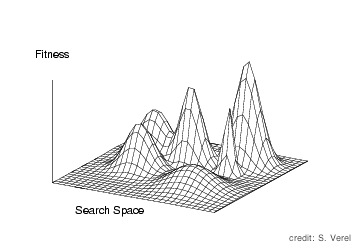

# How to perform a fitness analysis?



A lot of tools to perform the fitness landscapes analysis are defined in paradisEO-MO:
* Density Of States
* Fitness Distance Correlation
* Autocorrelation length and autocorrelation functions
* Sampling the local optima by adaptive walks
* Neutral degree distribution
* Evolvability of neutral networks by neutral walks
* Fitness Cloud

With the same code (and effort ;-) ), you can make an apriori study of your problem with fitness landscapes analysis and use efficient solution-based metaheuristics. You can also make an aposteriori fitness landscapes analysis of your problem to explain why your metaheuristics works or not.

This lesson will let you:
* Use the fitness analysis tools of MO library
* Learn to perform your own fitness landscapes analysis

In lesson 1, you have learnt to define the fitness function. In lesson 2, you have learn to define a neighbor and a neighborhoods. This lesson will used those previous lessons.

This tutorial is made to learn how to perform a fitness landscapes analysis with paradisEO-MO. It is not a course to learn fitness landscapes analysis. You can find some information about fitness landscapes analysis here: [tutorial GECCO 09 (pdf)](http://www.i3s.unice.fr/~verel/talks/tutorialFitnessLandscapes_gecco2009.pdf) or [tutorial WCCI-CEC 10 (pdf)](http://www.i3s.unice.fr/~verel/talks/tutorialCEC2010.pdf)

## 1. I want to compute the Fitness Distance Correlation (FDC)!

You can compute the FDC. From the "paradiseo-mo/build/tutorial/Lesson6" directory, type:
```shell
./fdc -V=20 -n=500
```

Great! You have sample fitness and distance to global optimum of 500 random solutions on the oneMax problem (which maximizes the number of ones in the bit string) for the bit strings of size 20. On your output screen, you can see the fitness and distance of the first and last solution of the sample. For example:
```text
First values:
Fitness 8
Distance 12
Last values:
Fitness 6
Distance 14
```

In the file "out.dat", you have all the sample. First column is the fitness and the second column is the distance to global optimum of the 500 solutions.

After you can compute the correlation coefficient with your best statistical software such as R (with this small script) or excel with this help (import data and correlation) or with this small awk script.

I found -1 with my sample which means that it is very easy function, isn't it?

## 2. The main principles of fitness landscapes analysis with MO

The fitness landscapes analysis is based on a sampling of the search space. During this sampling, data are collected, and then some statistics can be computed to deduce the structure of the search space.

The class to define a sampling is moSampling<Neighbor> in the directory mo/src/sampling. All classes of the standard tools of fitness landscapes analysis inherit from this class (see documentation):
* moDensityOfStatesSampling : density of states (distribution of fitness values)
* moAutocorrelationSampling : autocorrelation length and functions
* moFDCsampling : fitness distance correlation
* moHillClimberSampling : adaptive walks
* moNeutralDegreeSampling : neutral degree
* moNeutralWalkSampling : evolvability of neutral networks
* moFitnessCloudSampling : evolvability of the operator, and the neighborhood

The constructor of moSampling is:
```c++
moSampling (eoInit< EOT > &_init, moLocalSearch< Neighbor > &_localSearch, moStat< EOT, ValueType > &_stat, bool _monitoring=true)
```

As usual in paradiseo, EOT is the typedef of the solution, and Neighbor is the typedef of the neighbor (see lesson 1). This constructor needs an initialization methods (see tutorial on paradiseo-eo), a local search which perform the sampling of the search space (see previous lessons to define it), and a object which able to compute a statistic. At each iteration of the local search, the given statistic is computed, and is saved if boolean monitoring is true.

The statistics inherit from the class moStat. The include file can be found in mo/src/continuator directory. The pre-defined statistics are:
* moFitnessStat : the fitness of the current solution
* moDistanceStat : the distance between the current solution and a given solution
* moSolutionStat : the current solution
* moCounterStat : the number of iterations
* moBestSoFarStat : the best current solution found
* moNeighborBestStat : best fitness over k neighbors
* moNeighborhoodStat : to compute the statistics from the neighbors solutions :
  * moAverageFitnessNeighborStat : average fitness in the neighborhood
  * moStdFitnessNeighborStat : standard deviation of fitness
  * moMaxNeighborStat : maximum fitness
  * moMinNeighborStat : minimum fitness
  * moSecondMomentNeighborStat : average and standard deviation
  * moSizeNeighborStat : size of the neighborhood
  * moNeutralDegreeNeighborStat : number of neighbors with equal fitness
  * moNbInfNeighborStat : number of neighbors with lower fitness
  * moNbSupNeighborStat : number of neighbor with higher fitness

All those statistics can be used in the sampling. Of course you can define your own statistic class. Several statistics can be collected at each iteration: use the method add of the class moSampling to collect another statistic.

For standard tools of fitness landscapes analysis, there is no need to give the sampling method, and the statistics objects. You only have to give which is specific to your problem such as the initialization method, the fitness function, the neighborhood, or the evaluation function of a neighbor.

## 3. Browsing the code

Please, open the file "mo/tutorial/Lesson6/fdc.cpp", and follow me in the code:

### 1. The includes part:

The general includes for the c++ stdlib streams:
```c++
#include <stdexcept>     
#include <iostream>      
#include <sstream>       
#include <fstream>       
#include <string.h>      
```

This includes for eo which contains all include files of EO:
```c++
#include <eo>
```

The first line to include the bit string representation defined in eo, and the second one to include the bit string neighbor representation. All classical problem-dependent part of MO are defined in the sub-directory "problems". How to define your representation is explained in EO tutorial, and how to design your neighbor is explained in the lesson 2. Here just use it.
```c++
#include <ga/eoBit.h>                         
#include <problems/bitString/moBitNeighbor.h>
```

This includes the evaluation function of a solution (full evaluation). There is no evaluation function for the neighbor because there is no need in FDC. Some others tools such as autocorrelation neighbor evaluation is defined such as the lesson 1.
```c++
#include <problems/eval/oneMaxFullEval.h>
```

The fitness distance correlation is the correlation between the fitness of solution and the distance to global optimum (or at least to some best known solution). So, this include file uses the Hamming distance.
```c++
#include <utils/eoDistance.h>
```

Now we can include the FDC tool.
```c++
#include <sampling/moFDCsampling.h>
```

### 2. The typedef part:

EO can apply an evolutionary algorithm on any type of solution. So, all EO classes are parametrized by the type of solutions, and it is useful to use a synonym (with a typedef) of the solution's type.
MO can apply an local search algorithm on any type of solution and neighbor. So, for the same reason, all classes of MO are parametrized by the neighbor's type. In the neighbor class, the solution's type is defined. More precision on the neighbor design will be given in the lesson 2.
Here the solution representation is a bit string and the neighbor representation is related to a bit string solution and Hamming distance 1 (only 1 bit can be flipped), both using an "unsigned int" fitness value.
```c++
typedef eoBit<unsigned int> Indi;
typedef moBitNeighbor<unsigned int> Neighbor;
```

### 3. Object definition part:

Follows the main function "main_function" where all useful objects are defined.\\
First, a code to parse the command line and a file. It gives the value of the random seed and the size of bit string. The lesson 3 of EO tutorial gives more precision on this code. Here we have only to understand that the variables "seed" and "vecSize" are initialized.
```c++
eoParser parser(argc, argv);

eoValueParam<uint32_t> seedParam(time(0), "seed", "Random number seed", 'S');
parser.processParam( seedParam );
unsigned seed = seedParam.value();

// length of the bit string
eoValueParam<unsigned int> vecSizeParam(20, "vecSize", "Genotype size", 'V');
parser.processParam( vecSizeParam, "Representation" );
unsigned vecSize = vecSizeParam.value();

// the number of solution sampled
eoValueParam<unsigned int> solParam(100, "nbSol", "Number of random solution", 'n');
parser.processParam( solParam, "Representation" );
unsigned nbSol = solParam.value();

// the name of the output file
string str_out = "out.dat"; // default value
eoValueParam<string> outParam(str_out.c_str(), "out", "Output file of the sampling", 'o');
```

To seed the random seed (see lesson 1 of EO tutorial for more precision):
```c++
rng.reseed(seed);
```

The definition the initialization of solutions is not defined is MO but in EO. The "eoInitFixedLength" is a class that makes a random intialization of bit string of a given length. Each bit is true with 1/2 rate. You can see the lesson 1 of EO tutorial lesson 1 for more precision.
```c++
eoUniformGenerator<bool> uGen;
eoInitFixedLength<Indi> random(vecSize, uGen);
```

The fitness function of the oneMax problem is the number of 1 in the bit string. It is already defined in MO:
```c++
oneMaxFullEval<Indi> fullEval;
```

The distance used is the classical Hamming distance:
```c++
eoHammingDistance<Indi> distance;
```

For this analysis, the best solution is needed: the solution with all 1s.
```c++
Indi bestSolution(vecSize, true); // global optimum
```

All representation-dependent part is now defined, so the FDC sampling can be defined. The constructor needs the initialization, the fitness function, the distance used, the reference solution, and the size of the sample:
```c++
moFDCsampling<Neighbor> sampling(random, fullEval, distance, bestSolution, nbSol);
```

### 4. The execution of sampling part:

Now apply your sampling as follows:
```c++
sampling();
```

This sampling uses the initialization method to define a pure random search, and at each iteration the fitness and the distance are computed.

4. The export part:

To export your sample into a file:
```c++
sampling.fileExport(str_out);
```

The first column of the file is the fitness and the second the distance from the global optimum.

Maybe you may want to read the data from your c++ code. So it is possible to export the data into a vector:
```c++
const std::vector<double> & fitnessValues = sampling.getValues(0);
const std::vector<double> & distValues    = sampling.getValues(1);
```

Note that the indexes of the statistics (here 0 and 1) are in the same order of the declaration with the constructor and the "add" method of moSampling.

After you can use the vector as you want:
```c++
std::cout << "Fitness  " << fitnessValues[0] << std::endl;
std::cout << "First values:" << std::endl;
std::cout << "Distance " << distValues[0] << std::endl;

std::cout << "Last values:" << std::endl;
std::cout << "Fitness  " << fitnessValues[fitnessValues.size() - 1] << std::endl;
std::cout << "Distance " << distValues[distValues.size() - 1] << std::endl;

```

Easy, isn't it?

## 4. Others fitness landscapes tools

The other tools can be used in the same way. For each tool, an example has been made. Please read the code of:

* densityOfStates.cpp : density of states example
* autocorrelation.cpp : autocorrelation length and functions
* adaptiveWalks.cpp : sampling by hill-climbings, length of adaptative walks
* fdc.cpp : ;-)
* fitnessCloud.cpp : bivariate density of fitness of solutions and fitness of neighbors
* neutralDegree.cpp : number of neighbor with the same fitness
* neutralWalk.cpp : evolvability of the neutral networks
* sampling.cpp : general sampling method

If you have some questions or remarks, please contact us! sebastien.verel aaattt unice.fr or member of the development team.